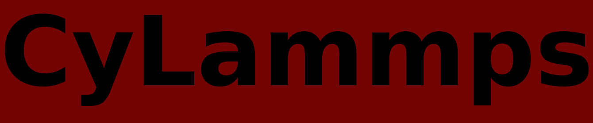

# Introduction

CyLammps is a python library used to analyze molecular dynamics simulations. 
Simulations are produced by [LAMMPS](https://docs.lammps.org/Manual.html).
All the quantity calculated are really important to study the mechanical properties of amorphous materials.
Among the others there is the [coarse-grained stress](https://link.springer.com/article/10.1140/epje/i2002-10073-5)
and the [stress spatial autocorrelation functions](https://journals.aps.org/prl/abstract/10.1103/PhysRevLett.113.245702).

I used [Cython](https://cython.readthedocs.io/en/latest/index.html) as a programming language in order to translate the code into an optimized C code and to compile it as a Python extension module. This allows me to obtain very fast program execution and to preserve the advantages of Python.

# Compile the code
To compile the extension in the current directory do:

    python setup.py build_ext --inplace

Then, to import the extension module in your python code use:

    from CyLammps import *

# Publications
This code was used quite a lot by me in the following papers:

1. [Plastic ridge formation in a compressed thin amorphous film](https://arxiv.org/abs/2209.09055)

2. [Neural Networks Reveal the Impact of the Vibrational Dynamics in the Prediction of the Long-Time Mobility of Molecular Glassformers](https://www.mdpi.com/1422-0067/23/16/9322)

3. [Nanoscale Elastoplastic Wrinkling of Ultrathin Molecular Films](https://www.mdpi.com/1422-0067/22/21/11732)

